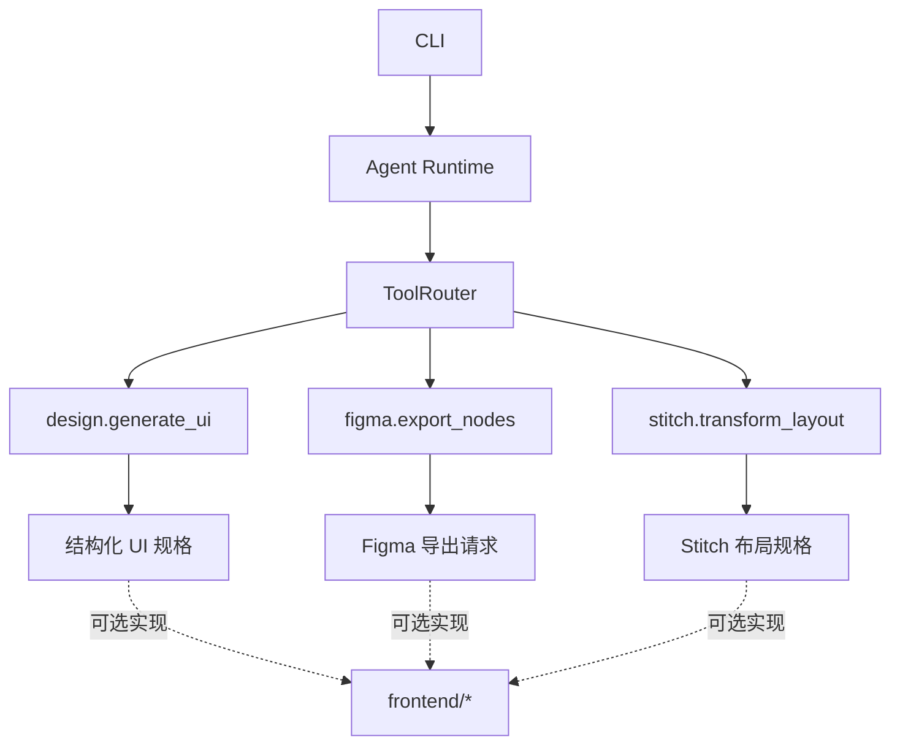

# Genesis Lab

## 1. 项目标题

Genesis Lab

## 2. 概述

Genesis Lab 是一个面向科研工作流的 AI 实验性原型。它将自然语言科研问题编译为结构化研究任务，构建可执行 DAG，运行本地代理与轻量级代码检查，记录证据条目，并生成 Markdown 研究报告。

该项目主要解决的问题是：把科研问题拆解、证据收集、执行日志、报告生成和证据映射放到同一个可审计流程中，便于研究人员、工程原型开发者和学生理解一个科研任务从问题到报告的最小闭环。

当前仓库更接近 MVP/实验系统，不是生产级科研检索平台。代码中使用本地示例语料和确定性代理逻辑来验证流程，不依赖外部学术 API 或 LLM API。

## 3. 核心功能

- 将自然语言问题编译为 `ResearchTask`，包含领域、子问题、假设和方法。
- 根据研究任务生成 DAG，并进行依赖校验和拓扑排序。
- 通过 FastAPI 提供研究任务编译、运行创建、运行查询、证据查询和报告导出接口。
- 使用本地 `LiteratureAgent`、`CodeAgent`、`SynthesisAgent` 和 `ReviewAgent` 完成最小研究闭环。
- 记录 evidence item，将报告结论与文献片段或代码输出关联。
- 提供 Next.js/React 工作台，用于展示问题输入、DAG、执行日志、证据面板和 Markdown 报告。
- 包含后端单元测试和 API smoke test。

## 4. 架构

### 核心系统

后端核心由 `backend/app/core/` 提供：

- `compiler.py`：将用户问题规范化，并基于启发式规则推断领域、子问题、假设和方法。
- `dag.py`：将研究任务转换为 DAG 节点，校验依赖关系并执行拓扑排序。
- `runtime.py`：协调编译、DAG 构建、代理执行、证据存储、报告合成和审阅。
- `agents.py`：实现本地文献代理、代码代理、报告合成代理和自检代理。
- `evidence.py` / `storage.py`：以内存结构保存证据和运行记录。
- `main.py`：暴露 FastAPI HTTP 接口。

数据流：

```text
用户问题
  -> ResearchCompiler
  -> DagEngine
  -> GenesisRuntime
  -> LiteratureAgent / CodeAgent
  -> EvidenceStore
  -> SynthesisAgent
  -> ReviewAgent
  -> Markdown 报告
```

### 实验性与辅助组件

`frontend/codex/`、`frontend/mcp/` 和 `frontend/stitch/` 包含前端验证说明、提示词和布局 JSON，属于实验/辅助资产。它们可为后续自动化代码生成、UI 替换或工作台布局迭代提供上下文，但当前主运行链路仍以 FastAPI 后端和 Next.js 前端为准。

## 5. 安装

克隆仓库：

```bash
git clone https://github.com/SennaGit/Genesis-Lab.git
cd Genesis-Lab
```

安装后端依赖：

```bash
python -m pip install -r backend/requirements.txt
```

安装后端测试依赖：

```bash
python -m pip install -r backend/requirements-dev.txt
```

安装前端依赖：

```bash
cd frontend
pnpm install
```

## 6. 使用

启动后端 API：

```bash
uvicorn app.main:app --reload --app-dir backend
```

检查服务健康状态：

```bash
curl http://localhost:8000/health
```

编译一个研究问题：

```bash
curl -X POST http://localhost:8000/api/research/compile \
  -H "Content-Type: application/json" \
  -d "{\"question\":\"为什么量子纠缠不违反相对论？\"}"
```

创建一次完整运行：

```bash
curl -X POST http://localhost:8000/api/runs \
  -H "Content-Type: application/json" \
  -d "{\"question\":\"如何设计一种新的 mRNA 疫苗？\"}"
```

返回结果中的 `runId` 可用于查询运行、证据和报告：

```bash
curl http://localhost:8000/api/runs/<runId>
curl http://localhost:8000/api/runs/<runId>/evidence
curl http://localhost:8000/api/runs/<runId>/report
```

启动前端工作台：

```bash
cd frontend
pnpm run dev
```

前端默认访问 `http://localhost:3000`，并默认连接后端 `http://localhost:8000`。

运行后端测试：

```bash
cd backend
python -m unittest discover -s tests
```

运行前端检查：

```bash
cd frontend
pnpm run typecheck
pnpm run lint
pnpm run build
```

## 7. 项目结构

```text
Genesis-Lab/
  backend/
    app/
      main.py
      core/
        agents.py
        compiler.py
        dag.py
        evidence.py
        models.py
        runtime.py
        storage.py
    tests/
      test_api.py
      test_core.py
    requirements.txt
    requirements-dev.txt
  frontend/
    app/
      globals.css
      layout.tsx
      page.tsx
    features/
      research-workspace/
    services/
      api-client.ts
      research.service.ts
    ui/
      components/
      contracts/
      layouts/
    codex/
    mcp/
    stitch/
    package.json
    pnpm-lock.yaml
  doc/
    bg.md
  README.md
  .gitignore
```

## 8. 配置

后端当前不要求环境变量即可运行。FastAPI 中配置了本地开发 CORS 来源，包括 `localhost` / `127.0.0.1` 的 `3000`、`5173`、`5174` 和 `5175` 端口。

前端可通过环境变量修改 API 地址：

```bash
NEXT_PUBLIC_API_BASE=http://localhost:8000
```

项目当前使用内存存储运行记录和证据。服务重启后，运行状态、证据和报告不会持久保留。

### LLM Provider

Genesis CLI/Agent Runtime 通过 `/providers` 提供统一模型接口，core runtime 只依赖 `LLMProvider` 抽象，不直接绑定 OpenAI、Anthropic 或任何具体网关。

核心文件：

```text
providers/
  base.ts                 # LLMProvider、ProviderConfig 和通用类型
  openai.ts               # OpenAI Provider 导出
  openai_compatible.ts    # OpenAI-compatible / custom endpoint 实现
  anthropic.ts            # Anthropic Claude API 实现
  mock.ts                 # 本地测试 Provider，不访问网络
  config.ts               # ~/.genesis/config.json 配置读写
  index.ts                # createProvider 工厂
```

统一接口：

```ts
interface LLMProvider {
  chat(input: {
    messages: any[];
    tools?: any[];
    model?: string;
  }): Promise<{
    content: string;
    toolCalls?: any[];
  }>;
}
```

配置文件默认位于 `~/.genesis/config.json`，也可以用 `GENESIS_HOME` 指向其他目录。配置示例：

```json
{
  "provider": "custom",
  "apiKey": "",
  "baseURL": "https://example.com/v1",
  "model": "gpt-4.1"
}
```

支持的 provider：

- `mock`：默认离线 provider，用于本地测试 agent loop 和 tool calling。
- `openai`：OpenAI Chat Completions API。
- `anthropic`：Anthropic Messages API。
- `custom`：OpenAI-compatible endpoint，适合自建 LLM gateway、代理服务或兼容 OpenAI schema 的模型服务。

CLI 配置示例：

```bash
genesis config set provider custom
genesis config set baseURL https://example.com/v1
genesis config set apiKey <你的密钥>
genesis config set model gpt-4.1
genesis config show
```

## 9. 依赖

后端主要依赖：

- `fastapi`：提供 HTTP API。
- `uvicorn[standard]`：运行 ASGI 服务。
- `pydantic`：定义请求和响应数据模型。

后端测试依赖：

- `httpx`：用于 FastAPI TestClient 相关测试依赖。

前端主要依赖：

- `next`：React 应用框架。
- `react` / `react-dom`：前端 UI 运行时。
- `lucide-react`：工作台图标。
- `tailwindcss` / `postcss` / `autoprefixer`：样式构建。
- `typescript`：类型检查。
- `eslint` / `eslint-config-next`：代码检查。

## 10. 路线图

`doc/bg.md` 中包含更完整的研究工作台规划。基于当前代码和文档信号，后续可能方向包括：

- 将本地示例语料替换或扩展为真实学术数据源，例如 PubMed、arXiv 或其他可授权检索源。
- 将内存存储替换为可持久化存储。
- 增强代码执行隔离、运行日志和 artifact 管理。
- 扩展前端工作台的交互能力，例如更完整的 DAG 状态查看、证据追踪和报告导出。
- 增加 CI、部署配置和生产环境运行说明。

以上为规划信号，不表示当前仓库已经实现。

## 11. 说明

假设：

- 本 README 以当前已纳入 Git 仓库的 Python/FastAPI 后端、Next.js 前端和 `doc/` 文档为依据。
- “科研工作流”在当前版本中指本地 MVP 流程，不等同于真实联网文献检索、真实 LLM 推理或生产级实验平台。

限制：

- 文献代理使用本地示例语料，不会访问真实论文数据库。
- 代码代理只执行轻量级 Python 片段，用于验证可复现记录链路。
- 运行记录和证据使用内存存储，服务重启后丢失。
- 当前自检逻辑为规则化检查，不是独立同行评审或事实核查系统。
- 前端工作台依赖后端 API；若后端未启动，前端只能显示初始示例或错误状态。

不确定组件：

- `frontend/codex/`、`frontend/mcp/` 和 `frontend/stitch/` 更像实验性工程上下文，当前 README 不将其描述为稳定公开 API。

## 12. Tool System

Genesis 现在包含统一 Tool System，用于同时管理 local tools 和 MCP tools。

核心文件：

```text
tools/
  types.ts          # Tool、ToolCall、ToolResult、JSON Schema 类型
  registry.ts       # 工具注册中心，负责校验和查找工具
  router.ts         # ToolRouter，按 tool name dispatch
  mcp_adapter.ts    # MCP stdio forwarding 兼容层
  filesystem.ts     # 本地文件工具，例如 filesystem.read
  network.ts        # 网络工具
  design/           # Stitch / Figma / UI generator 工具化封装
  index.ts          # 默认 registry/router 工厂
```

统一工具接口：

```ts
interface Tool {
  name: string;
  description: string;
  inputSchema: object;
  run(input: unknown): Promise<unknown>;
}
```

默认工具包括：

- `echo`：回显输入。
- `filesystem.read`：读取当前工作目录内的文本文件。
- `list_files`：列出当前工作目录内文件。
- `read_file`：兼容旧名称的文件读取工具。
- `write_file`：写入当前工作目录内文本文件。
- `http_get`：执行 HTTP GET。
- `mcp.forward`：转发调用到 stdio MCP server。
- `mcp_call`：兼容旧版 MCP 调用格式。
- `design.generate_ui`：生成 headless UI 规格，UI 只作为 tool output。
- `figma.export_nodes`：将 Figma file/node 输入标准化为导出请求。
- `stitch.transform_layout`：把 Stitch layout JSON 转换为结构化布局规格。


### UI 能力工具化依赖关系

UI、Stitch 和 Figma 相关能力已经从核心执行链路中剥离，只能作为 Tool 被调用。core/agent 不导入前端、不导入 Stitch、不导入 Figma；CLI 在没有 UI 的环境中仍可运行。



Agent Runtime 可以通过 `ToolRouter` 调用工具：

```ts
import { GenesisAgent } from "./core/agent.ts";
import { MockProvider } from "./providers/mock.ts";
import { createDefaultToolRegistry, ToolRouter } from "./tools/index.ts";

const registry = createDefaultToolRegistry(process.cwd());
const router = new ToolRouter(registry);
const agent = new GenesisAgent(new MockProvider(), registry, { dispatcher: router });

const result = await agent.run("列出当前目录文件");
console.log(result.output);
```
