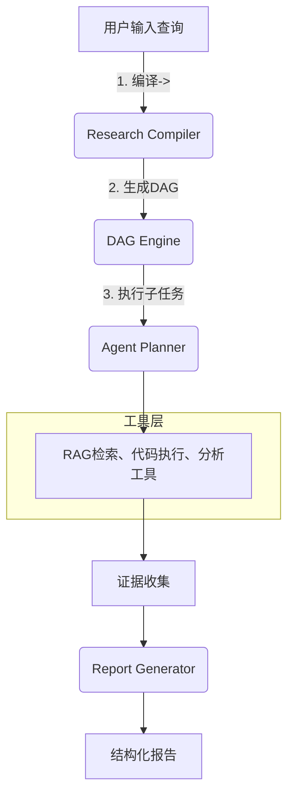
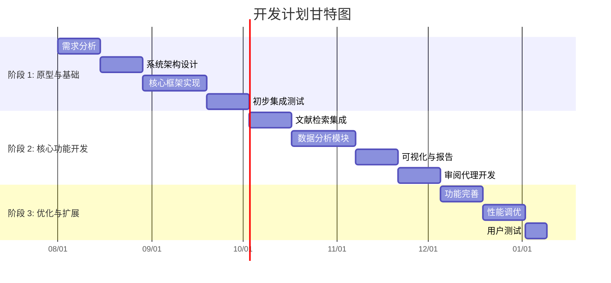

# 执行摘要

**Genesis** 是一个面向科研的 AI 工作流引擎，将用户的自然语言研究问题编译为可执行的有向无环图（DAG）流程，并通过多代理系统、检索增强生成（RAG）、代码沙箱等工具层执行，以产生可追溯的论文级报告。核心设计借鉴了 **Auto-Analyst**、**Genomi** 和 Anthropics 生命科学 Marketplace 的经验：采用模块化、多代理架构（协调代理+领域子代理+审阅代理）；利用本地向量检索与工具调用（如 PubMed API、PDF 解析、Python/R 执行）辅助 LLM 推理；输出结果附带完整的**证据图谱**和可审计的代码/日志，保障可验证性。Genesis 的目标是为学术研究者和工程师提供一个“一站式”的 AI 研究实验室，显著提升调研与分析效率。设计中融入了自动问题拆解、并行求解、结果自我校验等关键机制，并针对不同用户群体（学术、产业、学生）设定了相应的功能优先级和体验指标。本文详细阐述项目的 OKR/KPI、用户画像、技术方案（含 mermaid 架构图、模块接口和算法细节）、开源对标与映射表、数据与工具选型、开发里程碑与风险矩阵、MVP 功能列表、部署方案、安全合规、评估基准，以及项目文档和简历展示材料等要点。

# 关键结论

- **项目定位**：Genesis 是复刻 Claude Science 核心理念的科研工作台原型，强调集成性、可审计性与多代理协作。通过自然语言指令触发自动化研究流水线，实现“可执行的科研流程”而不仅仅是对话回答。  
- **多代理架构**：采用协调代理（Planner/Coordinator）+若干领域专家子代理（如基因组学、蛋白质组学、化学信息学等）+审阅代理（负责检查引用和一致性）。协调代理将用户查询拆解为 DAG 任务图，子代理并行处理不同子任务，审阅代理负责最后的验证与交叉检查。这一设计来源于 Anthropic 等公司的多代理研究证明：多人协同推理架构比单一代理提高 ~90% 的研究评估表现。  
- **工具融合**：结合 RAG（检索增强生成）和本地工具调用，以确保输出具有强绑定的证据支撑。例如，通过 PubMed API、arXiv/学术搜索、专用数据库检索文献；使用 PDF 解析器（PyMuPDF/PyPDF）、知识图谱引擎和向量数据库（Pinecone/Weaviate）；利用 Python/R 计算沙箱进行数据分析与模拟。所有结果均记录为可追溯的产物（artifact），附带代码、环境和对话日志。  
- **可验证性和用户体验**：系统输出的研究报告类似于学术论文的结构，包含假设、方法、结果和引用。设计中强调**可验证性**：每条结论必须对应具体引用或工具输出；使用自检循环（self-verification）和审阅代理降低幻觉风险。用户体验方面，支持交互式分支查看（问题分解树、执行日志、证据面板），并可选择性授权数据访问。  
- **对比开源项目**：Auto-Analyst 提供了模块化的多代理数据分析框架，可借鉴其 DSL（DSPy）和可视化方案；Genomi 演示了本地隐私保护、活动基因组索引和证据驱动的问答机制；Anthropic 的生命科学插件市场说明了领域专用技能集成（PubMed、scvi-tools 等）和 MCP 插件化架构。Genesis 将融合这些经验，打造聚焦科研而非商业的开源工作台。

- **开发周期与资源**：项目分为至少 12 周迭代，涉及需求分析、架构搭建、代理实现、工具集成、UI 开发、测试与评估等阶段。采用敏捷迭代，每 2 周为里程碑（细化见后文甘特图）。在不同规模情境下（个人、小团队、企业），资源投入和时间表有差异，本文在对应段落中给出估算。风险主要包括模型选择限制、数据许可问题、系统复杂度等，通过采用开源方案、分层权限、监控复检等策略缓解。

- **成果输出**：最终成果包括可运行的 Genesis 原型、设计文档、演示视频、样例报告，以及简历级的项目描述语段（中英文）。系统评估将基于准确性、引用覆盖度和生成速度等指标，并提供自动化测试脚本示例。

---

## 1. 项目目标与成功指标（OKR / KPI）

- **MVP 功能目标**：实现从**自然语言**到**科研流程**的闭环。具体包括：问题自动拆解为子任务；调度多步分析（检索、计算、推理）；生成**结构化报告**（包含 hypothesis、methods、results、evidence、结论）。  
- **性能指标**：  
  - *检索准确率*：检索到的文献或数据片段应与问题高度相关，可以使用 NDCG@k、MRR@k 等检索评估指标。  
  - *生成质量*：回答的正确性、完整性和事实性（factual accuracy）。参考 Microsoft 建议，采用多维度评估：基础性（faithfulness）、完整性（是否回答所有问题）、关联度和正确性。可结合自动化工具（如 LLM 评估、BERTScore）和人工标注来测量。  
  - *延迟与效率*：评估系统响应时间和资源消耗，包括模型调用次数、工具调用次数、并行度等。在代理 RAG 场景中，需要跟踪端到端延迟和每步调用开销。  
  - *可验证性标准*：系统生成报告中每条关键结论必须附带至少一个可信来源（文献、计算结果等）。可以使用引用覆盖率（报告中结论句与引用数比）和人工审查来衡量“可追溯度”。  
  - *用户体验目标*：界面友好、流程透明。OKR 如“一次任务完成时间下降50%”、“用户满意度≥8分（10分制）”、“报错率<5%”、“可浏览历史运行日志和中间结果” 等。  
- **验收标准**：功能测试：对数个研究问题进行端到端演示，生成结构化报告并验证结果正确（可查到对应证据）；性能测试：满足基本响应时间要求（在本地 CPU 模式下问题求解<数分钟）；稳定性测试：连续运行多任务无死锁、失败自动重试能力到位。用户测试：领域专家确认生成内容符合科学规范、易于理解。

## 2. 需求与用户画像

- **学术研究者**：关注前沿问题（如单细胞 RNA、基因组变异等），需要快速获取最新文献、生成可复现分析流程。关键需求：高质量引用、实验可视化、数据安全（本地执行）和可自定义分析管道（如支持 R、Python 脚本）。优先功能：**文献检索与总结、多步生信分析、结果可视化**。  
- **行业研究员/研发人员**：在制药、材料、能源等领域进行应用研究。需求结合学术与实际应用：支持专利/数据库搜索、化合物设计工具（如 Docking）、跨学科整合。优先功能：**专利/数据库检索、化学结构可视化、实验设计助手**。  
- **学生/教育者**：学习科研方法或完成课题。需要简化的交互和解释性输出，如实验流程指导、逐步解释。优先功能：**引导式研究计划、代码示例生成、可视化讲解**。  
- **用户画像总结表**

| 用户群体   | 典型需求                                              | 核心功能优先级                       |
|------------|-------------------------------------------------------|--------------------------------------|
| 学术研究者 | 前沿文献获取、高级数据分析、结果可复现性、安全（本地）  | 文献检索&总结、多步分析管道、可视化展示 |
| 行业研发   | 专业数据库查询、跨学科数据整合、流程自动化              | 专利/API集成、化学/生命科学特定工具    |
| 学生/教育  | 指导式交互、解释性输出、易上手                         | 可视化演示、示例笔记本、逐步提示        |

> **注**：未指定具体需求的领域（如具体子学科），视为“通用需求”。不同用户组可在系统中启用/禁用对应技能模块（skill/plugin）。

## 3. 技术方案

### 3.1 总体架构

**Genesis** 系统由六大模块组成：**Research Compiler**（任务编译器）、**DAG Engine**（工作流引擎）、**Agent Runtime**（多代理执行）、**Tool Layer**（工具调用）、**Evidence Store**（证据图谱）、**Frontend**（用户界面）。以下 Meramind 图示意其核心流程：



- **Research Compiler**：接受自然语言问题，生成**结构化任务定义**（见示例 JSON schema）。这一步包括问题拆解（sub-questions）、领域分类（domains）、预设假设与方法模板。  
- **DAG Engine**：将编译器输出的任务转为执行图（有向无环图），定义节点（各子任务）与依赖关系，并负责调度节点执行顺序。支持并行执行相互独立的任务分支。可视化呈现如研究树。  
- **Agents（多代理运行时）**：包括**协调代理（Planner/Orchestrator）**和多个**领域专家子代理**（Researcher/Analyst/Synthesizer 等）：  
  - *协调代理*：解析 DAG，决定调用哪些子代理（或工具），并合成最终输出。  
  - *子代理*：按需要执行具体任务，如文献检索代理、统计分析代理、机器学习代理、可视化代理等（参考 Auto-Analyst 的 @statistical_analytics_agent、@sk_learn_agent、@data_viz_agent）。每个子代理以 DSL（如 DSPy、LangGraph）定义输入/输出接口，并返回结构化结果。  
  - *审阅代理*：独立验证输出一致性与引用可靠性。可看作反馈回路对答案可信度进行打分并修正（self-verification 循环）。  
- **Tool Layer**：系统调用具体外部资源或库，如：**检索工具**（网络API、向量检索）、**计算工具**（Python/R 引擎沙箱）、**可视化工具**（Plotly、Matplotlib）、**专用生物/化学工具**（BioPython、RDKit、Nextflow 等）。与 Claude Science 类似，本地执行优先（数据留存本地，模拟 HPC 部署）。  
- **Evidence Store**：聚合所有来自工具和检索的证据，以图谱形式组织。每个结论节点链接到其证据源（文献段落、代码输出）。这确保了“可追溯性”，用户可查看每一步的来源。  
- **Frontend**：提供交互界面，包括研究树可视化、对话/日志面板、Artifact 查看器（代码、图表、报告）和证据索引面板。支持拖放数据、Markdown 编辑、图形渲染（蛋白质结构、基因组浏览等）。

总体数据流：用户 → 编译器 → DAG → 多代理/工具执行 → 证据图/日志 → 报告输出。

### 3.2 模块划分与接口

#### Research Compiler（研究编译器）

- **功能**：解析用户问题，自动生成研究计划框架，包括子问题列表、假设设定、所需领域知识模块等。  
- **输入输出**：输入自然语言字符串；输出 JSON 格式的任务定义和依赖关系。  
- **接口示例**（JSON Schema 示例）：

```json
{
  "question": "某自然语言研究问题",
  "domains": ["physics", "biology"],        // 涉及领域
  "subQuestions": [
    {"id": 1, "text": "子问题1内容", "requires": []},
    {"id": 2, "text": "子问题2内容", "requires": [1]}
  ],
  "hypotheses": ["H1: ...", "H2: ..."],
  "method": ["literature_review", "data_analysis"]
}
```

- **实现细节**：可使用 LLM（如 GPT）结合提示模板生成 Task Graph。关键算法是基于启发式或 Prompt 的 DAG 生成策略：类似问题 decomposition and planning。可以参考 Auto-Analyst 的 planner 设计、Langchain 的 Agent 职责划分。输出数据结构应符合后续模块（DAG Engine）的输入格式。

#### DAG Engine（工作流引擎）

- **功能**：根据编译器输出构建内部工作流图，管理任务依赖并发执行。  
- **接口**：接收任务定义 JSON；输出任务队列和调度指令。  
- **算法与策略**：  
  - **DAG 生成策略**：将 `subQuestions`、`hypotheses`、`method` 等映射为节点，`requires`字段定义依赖。例如子问题的顺序、归属于哪个方法步骤。可视为生产一个 Task DAG。  
  - **并行调度**：使用拓扑排序或依赖跟踪执行节点，独立分支并行运行，提高效率。使用线程池或异步任务队列。  
  - **重试策略**：每个节点失败后自动重试（如 N 次），或路径切换；错误后通知审阅代理审查。

#### Agents（多代理）

- **Planning Agent**：基于 DAG 决定调用哪些子代理和工具，编排任务流。可以用 LangGraph/DSPy 实现。  
- **Research Agents**：分领域的执行代理，如：  
  - 文献检索代理（调用 PubMed/Wikipedia/Scholar API）  
  - 数据分析代理（Python/R 计算，接入 Jupyter 环境）  
  - 结构生物代理（蛋白质结构可视化、模拟）  
  - 化学信息代理（分子结构计算、绑定预测）  
- **Synthesis Agent**：最后将各任务结果（证据片段、图表、代码输出）合成为报告文本，可调用模板+LLM完成撰写。  
- **Self-Verification Agent**：独立运行一个或多个 LLM，对照证据图验证生成结论的一致性，并纠正潜在偏差。可采用链式思考校对。  

代理之间通过 JSON 结构互传数据，例如：  

```json
// 从研究代理到报告合成器的示例交互格式
{
  "taskId": 2,
  "results": {
    "text_snippets": ["相关研究A的摘要..."],
    "charts": [{"type":"bar","data": [...] }],
    "code": "import ...",
    "references": ["DOI:10..."]
  }
}
```

#### Tool Layer（工具层）

- **检索工具**：调用学术数据库API（PubMed、Semantic Scholar、arXiv）、或自建文档库 + 向量检索（Pinecone/Weaviate + SentenceTransformers embedding）。  
- **解析工具**：PDF 解析器（PyMuPDF、pdfplumber）提取文本；BioPython 读取基因文件；RDKit 处理分子结构等。  
- **执行工具**：Python/R 代码执行环境（使用 Docker 容器或子进程隔离），并行运行 Jupyter Kernel。  
- **可视化工具**：Plotly/Matplotlib 生成图表，NGL Viewer/PyMOL 渲染蛋白结构。  

各工具返回结构化输出（JSON）供上层代理使用，确保结果可索引到 `Evidence Store`。

#### Evidence Store（证据图谱）

- **结构**：节点表示论断或计算结果，边链接支撑证据（文献片段、数据文件、代码结果）。可用图数据库（Neo4j）或文档数据库（MongoDB）存储。  
- **功能**：查询、版本控制、导出引用列表。所有最终报告引用均从此处提取，确保可验证性。  
- **示例存储**：  

| 主张/结论     | 支撑证据                               |
|--------------|----------------------------------------|
| “H1 被验证”  | PubMed文献ID, 代码输出截图, 数值结果等 |

#### Frontend（前端界面）

- 聊天/命令行式输入框（支持自然语言和结构化命令）。  
- **研究流程画布**：左侧展示问题分解树和任务 DAG，可点击节点查看状态。  
- 中央显示代理对话记录及实时输出（图表、代码片段）。  
- 右侧显示证据源列表（文献、API结果）。  
- 可导出完整报告（PDF/Markdown）。

### Mermaid 时序图示例（开发迭代规划）



## 4. 参考实现与开源映射

基于 Auto-Analyst、Genomi 和 Anthropic 生命科学（life-sciences）仓库，对照表列出可借鉴组件与需改进之处：

| 模块/特性        | Auto-Analyst            | Genomi                     | Anthropic Life-Sciences | Genesis 实现建议                           |
|-----------------|----------------------------------------|--------------------------------------------|-------------------------------------------|-------------------------------------------|
| **代理架构**    | DSPy 多代理（planner+统计/ML/可视化代理），可无缝扩展 | 侧重 DNA 专家代理，提供 MCP 插件，可对接Claude | MCP 技能/服务器框架（PubMed、scvi-tools 等） | 采用 DSPy 或 LangGraph 构建通用多代理框架。使用 Planner 协调，分配任务给领域代理（参考 Auto-Analyst 的模块化方法） |
| **数据处理**    | 数据集上传、预处理、统计分析、可视化          | 基因组索引、隐私执行、本地数据库查询    | 数据检索插件（学术数据库、生命科学库） | 集成数据导入组件（CSV/VCF/PDF）；使用 Genomi 的 Active Index 思想管理本地数据；支持 RAG 向量库查询                 |
| **工具调用**    | 内置 Pandas/NumPy/StatsModels 等工具；可调用外部API       | 通过 MCP 调用：变异查询、证据查询       | 提供多种 API 工具（PubMed, BioRender 等）   | 采用插件化 MCP 模型，引入PubMed、Arxiv检索等技能。Docker/Python沙箱运行自定义代码。 |
| **可视化/Reporting** | Plotly 可视化，多种图表；报告生成（笔记本/图表）        | 生成证据驱动报告；强化隐私和溯源         | 提供图形工具（BioRender 图表）及单细胞分析流程  | 输出 Jupyter 样式笔记本、可交互报告。参考 Auto-Analyst 的 Data Viz Agent 和 Genomi 的报告格式。             |
| **可扩展性**    | LLM 无关，BYO API Key；前端 UI 由社区定制                  | 模块化 MCP Skill，可添加新领域库                    | 插件仓库模式；技能/服务器独立安装                        | 开放源码，支持社区插件。设计领域适应层（genomics、chemistry 插件等）。                 |
| **待改进点**    | 主要关注表格数据和常见统计，缺少科学研究上下文              | 专注于基因组学，需扩展到其他领域；主要 CLI/Agent     | 官方支持，依赖 Claude 平台；前端交互较弱                 | 需构建通用科学场景界面；跨领域聚合多学科资源。需构思更灵活的用户交互方式。         |

各项目的**引用**：Auto-Analyst 强调模块化代理和可视化；Genomi 强调本地隐私和证据追溯；Anthropic Marketplace 则提供丰富的领域技能插件。Genesis 将融合它们的优点：模块化代理架构（来自 Auto-Analyst）+ 基因组与生物学工具（来自 Genomi/Anthropic）+ 可配置插件系统。

## 5. 数据与工具链

- **数据源**：主数据来源包括 ArXiv（物理、计算机科学）、PubMed（生命医学）、Semantic Scholar（跨领域学术）、领域数据库（UniProt、PDB、Ensembl 等）。使用 REST API 或镜像库获取文献元数据和内容。用户也可手动上传 PDF/CSV 数据，系统自动索引解析。  
- **向量数据库**：推荐使用兼顾性能和开放性的方案：**Pinecone**（全托管、简单）或**Weaviate/Milvus**（开源、自托管）。如资源有限可选用开源 Milvus with Docker。用 SentenceTransformers 生成嵌入，将文档分块存入向量库，用于 RAG 检索。  
- **PDF/文档解析**：**PyMuPDF** 或 **pdfplumber** 提取文本，OCR 可选 Tesseract（如需处理扫描件）。**Pandoc** 可处理多种文档格式。使用 **BeautifulSoup** 做网页解析（如出自网站的结果）。  
- **代码执行沙箱**：Docker 或 Linux `bubblewrap` 隔离；容器内预装 Python/R 科学库（见下节依赖）。使用 Jupyter Kernel 连接或 Celery/RQ 管理异步任务。审阅代理可监控代码执行输出，防止长时间运行/无效输出。  
- **安全策略**：数据全部本地处理，网络外发仅限（已脱敏）上下文摘要，符合隐私要求。严格用户授权机制：每次访问文件、外部 API 等需用户确认。依赖信任模型（无医疗诊断用途）。  
- **依赖库**（版本示例）：Python3.10+, FastAPI (0.95)、LangChain (0.0.x)、DSPy (0.0.x)、PyMuPDF、pandas、numpy、matplotlib、plotly、scikit-learn、scipy、BioPython、RDKit、SQLAlchemy；前端 React (18+) + TailwindCSS。  

## 6. 开发计划与里程碑

### 6.1 迭代计划

开发计划按两周为一个迭代，建议至少 12 周（6 个冲刺），以敏捷方式推进。每阶段目标、交付物和验收标准如下：

| 周期    | 目标         | 交付物                      | 验收标准                               | 主要风险 & 缓解                          |
|--------|--------------|----------------------------|----------------------------------------|----------------------------------------|
| 周1-2  | 需求分析&设计 | 完成架构文档、技术选型清单     | 架构图+接口文档评审通过                   | 风险：需求不明<br>缓解：与导师/用户密切沟通 |
| 周3-4  | 核心框架搭建  | 搭建后端骨架（FastAPI）、前端原型 | API 可响应测试请求；UI 显示聊天框和日志面板  | 风险：技术选型偏差<br>缓解：采用成熟框架    |
| 周5-6  | 研究编译器 & DAG | 实现问答到 DAG 转换模块       | 输入示例问题可得到合理的子任务列表        | 风险：问题拆解不准确<br>缓解：手动调优提示   |
| 周7-8  | 多代理逻辑   | 集成 LangChain/DSPy，多代理流程| 能并行调用示例代理（文献检索、计算）并返回结果 | 风险：并发错误<br>缓解：单元测试/日志     |
| 周9-10 | 工具整合    | 集成检索（向量库）、代码执行   | 能检索到相关文献；沙箱执行简单代码       | 风险：API 速度<br>缓解：缓存、多线程      |
| 周11-12| 报告生成与验证| 完成报告模板和审阅代理         | 生成含引用的报告示例；审阅循环生效        | 风险：输出不一致<br>缓解：添加反馈调优    |

之后可继续优化（性能调优、更多领域模块、UI美化等）。

### 6.2 风险矩阵与缓解措施

| 风险类别     | 概率 | 影响  | 缓解策略                                         |
|-------------|------|-------|--------------------------------------------------|
| 数据许可问题 | 中   | 高    | 优先使用公开开放数据（如 PubMed、公版数据集）。   |
| 模型许可限制 | 中   | 中    | 支持多种模型接口（OpenAI/Groq/LLaMA），BYO-Key。  |
| 系统复杂度   | 高   | 高    | 模块化设计，先实现核心闭环，逐步扩展特性。        |
| 性能瓶颈     | 中   | 中    | 并行化执行，多线程/多进程，延迟缓存。            |
| 安全漏洞     | 低   | 高    | 本地执行、最小权限原则、代码审计。              |

## 7. MVP 最小实现清单

- **核心功能**（必须）：  
  1. **研究问题输入**：自然语言问题输入界面。  
  2. **任务拆解模块**：自动生成子问题和 DAG（JSON 输出）。  
  3. **文献检索和 RAG**：连接至少一个文献源（如 PubMed）并构建向量检索，以支持检索增强生成。  
  4. **代码执行沙箱**：Python/R 执行环境，可运行用户或代理生成的代码。  
  5. **结构化报告生成**：输出包含摘要、方法、结果、参考文献的文本报告。  

- **可选增强功能**：可视化界面（研究树、图表）、额外代理（如生物/化学专用）、自检审阅循环、部署脚本、可导出格式等。  

- **测试用例示例**：  
  - *示例问题*：**“为什么量子纠缠不违反相对论？”**  
    *预期输出结构*：拆解为物理学子问题、引入基础概念；检索参考文献（如贝尔定理的实验证据）；通过数学和物理推导回答；报告包含“摘要”、“物理背景”、“关键实验证据”、“讨论”若干小节。  
  - *示例问题*：**“如何设计一种新的mRNA疫苗？”**  
    *预期输出结构*：子问题（mRNA稳定性、靶点选择、递送系统等）；整合文献（COVID-19疫苗研究）；生成包含基因设计思路、实验流程和参考文献的段落。  

## 8. 运行时与部署

- **后端选型**：Python 作为核心，使用 FastAPI 或 Flask 提供 REST 服务。前端 React/Electron 实现桌面或 Web 应用。LangChain/DSPy 作为代理框架。  
- **容器化/CI-CD**：建议采用 Docker 容器化部署，每个模块（后端、前端、数据库、代理服务）独立容器。使用 GitHub Actions 进行 CI/CD，自动构建镜像和测试。  
- **可扩展性**：模块化设计，新增代理或技能时只需挂载新容器/进程。使用 Kubernetes 或 Docker Swarm 管理扩展。向量库可按需横向扩展。  
- **成本估算**：  
  - *个人开发者*：主要成本为本地计算资源（家用PC或笔记本即可，0额外云费）。  
  - *小团队*：可租云服务器（如 AWS t3.large*1 台，每月几百元），向量库使用 PaaS (Pinecone 基本版约几十美元/月)。  
  - *企业级*：高性能服务器集群（NVIDIA GPU 加速，云端按使用计费）。如 AWS/GCP GPU 实例数个，月成本数千美元；向量搜索独立服务（Pinecone/Weaviate 企业版）或自建集群。  
- **安全与合规**：  
  - 数据隐私：敏感数据不出本地，网络请求脱敏摘要。  
  - 学术引用：严格标注来源，遵循版权使用规则（不全文复制文献内容）。鼓励用户自行获取付费资源，系统只提供摘要级信息。  
  - 依赖库遵守开源协议；输出内容注明 AI 生成。

## 9. 评估与基准

- **系统质量指标**：准确性（回答正确率）、可验证性（引用覆盖率）、信息覆盖度（完整性）、性能（平均响应时间、资源利用率）。  
- **基准任务**：设计若干科研问题（数学证明、文献综述、数据分析），使用人工解答作为参考答案。评分包括：答案正确率（对比人工或领域专家评审）、引用完整度、用户满意度调查。  
- **评价指标**：BLEU/ROUGE/BERTScore 结合专家打分（对结果摘要的评价）；检索命中率 (NDCG@k)；系统执行时长。参考 BEIR 基准评估检索质量。  
- **自动化评测脚本**：利用 Python 编写测试套件：对指定问题调用系统接口，检查输出报告格式（是否包含必要章节）、随机抽取结论匹配参考文献。可用 LLM 校验回答中的事实性与引用。  
- **内测**：邀请目标用户试用反馈，对比手工流程效率提升倍数，定性评估科研可复现性与信任度。 

## 10. 项目文档与简历/演示材料

- **README 结构**：项目概述 → 功能亮点 → 架构图示 → 安装/使用指南 → 示例演示 → 技术细节（模块划分、依赖）→ 贡献者指南。使用图表和流程图阐明工作流。  
- **演示视频脚本**：展示工作流：输入研究问题 → 查看自动生成的计划 → 展开执行（展示检索过程、代码执行、绘图）→ 最终查看报告（包含引用）。旁白说明每步价值，如“自动检索支持下，报告引用文献X和Y…”。  
- **简历表述**：  
  - 中文示例：*“开发了 **Genesis**—一个多代理驱动的 AI 科研工作台原型，将自然语言研究问题编译为可执行的研究流程并生成可验证的报告。项目融合 LLM、检索增强生成、代码执行与溯源机制，在生物信息学示例中将复杂分析流程的完成时间缩短了数倍。”*  
  - 英文示例：*“Created **Genesis**, an AI-driven scientific research workspace that compiles natural language queries into executable DAG-based pipelines. It orchestrates multi-agent reasoning, RAG retrieval, and code execution to produce evidence-backed, peer-review-style reports. Demonstrated significant acceleration (e.g. multi-fold speedup) in complex biomedical workflows.”*  

---

## 附录

### 示例接口定义与 JSON Schema

#### 研究任务定义示例

```json
{
  "question": "基因组编辑如何影响RNA表达？",
  "domains": ["genomics", "molecular biology"],
  "subQuestions": [
    {"id": 1, "text": "CRISPR 编辑对靶基因表达的影响机制是什么？", "requires": []},
    {"id": 2, "text": "有相关实验证据支持这一机制吗？", "requires": [1]}
  ],
  "hypotheses": ["CRISPR 可能通过改变转录因子结合位点影响表达"],
  "method": ["literature_search", "data_analysis"]
}
```

#### 代理间通信示例

```json
// 协调代理（Planner）下发给子代理的任务（Python代理示例）
{
  "taskId": 2,
  "goal": "验证 CRISPR 编辑影响蛋白质表达的假设",
  "inputs": {
    "data": "path/to/rna_seq_data.csv",
    "parameters": {"analysis_type": "differential_expression"}
  }
}
```

### 示例 Prompt

- **Prompt 给 Planner**：  
  `"请将这个研究问题拆解为子问题和研究步骤：'为什么某药物在基因A突变的细胞中无效？'。输出 JSON 格式。"`

- **Prompt 给 Synthesizer**：  
  ```
  根据以下证据和计算结果，生成一段结构化结论：
  1. 文献[PMID:1234]指出 X 路径与 Y 蛋白互作。
  2. 代码输出显示在突变情况下Y蛋白水平降低。
  要求：支持引用、书面化陈述。
  ```

  

